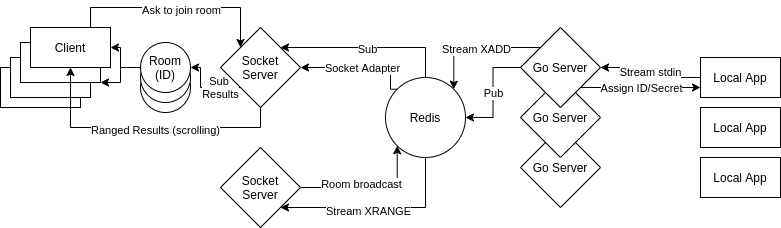

# stream.go
A highly performant and scalable shell monitoring tool.

Pipe your input and get handed a custom URL to monitor the progress.

Using: Redis (queues, sets, pub/sub), Go, React.js, Socket.io, Express, TypeScript

# High-Level Diagram

# Todo
- Get MVP of socketio/client side working
- Clean up shared code components
- Host the FE github pages (https://medium.com/@alvinnguyen116/virtual-and-infinite-scrolling-in-react-d56a05976cd2)
- Setup CI/CD w/ some cloud provider & get integrated with redis
- Write dockerfiles/k8 config for spinning up these services
- Abstract out some of the go code (services, multiple files, global variables for URLs, etc)